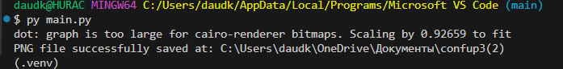
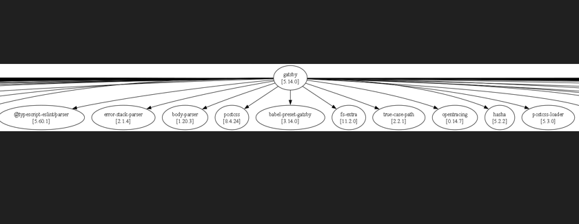

# вариант задания "5", группа 78-23

# Задания
Разработать инструмент командной строки для визуализации графа 
зависимостей, включая транзитивные зависимости. Сторонние средства для 
получения зависимостей использовать нельзя. 
Зависимости определяются по имени пакета языка JavaScript (npm). Для 
описания 
графа зависимостей используется представление Graphviz. 
Визуализатор должен выводить результат в виде сообщения об успешном 
выполнении и сохранять граф в файле формата png. 
Конфигурационный файл имеет формат toml и содержит: 
• Путь к программе для визуализации графов. 
• Имя анализируемого пакета. 
• Путь к файлу с изображением графа зависимостей. 
• URL-адрес репозитория. 
Все функции визуализатора зависимостей должны быть покрыты тестами. 
## описание
файл main.py содержит основные исполняемые функции такие как:
- функция get_dependencies() - получение зависимостей пакета
- функция genereate_png () - генерация png файла
- функция clean_version () - очистка версии пакета
файл test_func.py содержит тесты для этих функций
## примеры

так выглядит запуск файла main.py и результат при успешном выполнении

так выгладяит результат работы 
фото обрезано так как не влазит в рамки 
выходнм результатом работы будет файл base.png
## тесты
```$ py -m unittest test_func.py
dot: graph is too large for cairo-renderer bitmaps. Scaling by 0.926328 to fit
PNG file successfully saved at: C:\Users\daudk\OneDrive\Документы\confup3(2)
.PNG file successfully saved at: C:\Users\daudk\OneDrive\Документы\confup3(2)
..
----------------------------------------------------------------------
Ran 3 tests in 0.003s

OK
(.venv) 
```
так выглядит запуск тестов из файла test_func
нагоядно видно что все тесты пройденны успешно 

## конфигурационный файл
конфигурационный файл называется config.toml
```
url = "https://registry.npmjs.org//"
npm_name = "gatsby"
save_path = "C:\\Users\\daudk\\OneDrive\\Документы\\confup3(2)"
graphviz_path = "C:\\Program Files\\Graphviz\\bin\\dot.exe"
```
содержмое конфиг файла содержит все необходиме материалы и  они импортируются в main.py для правильной работы при исполнении

